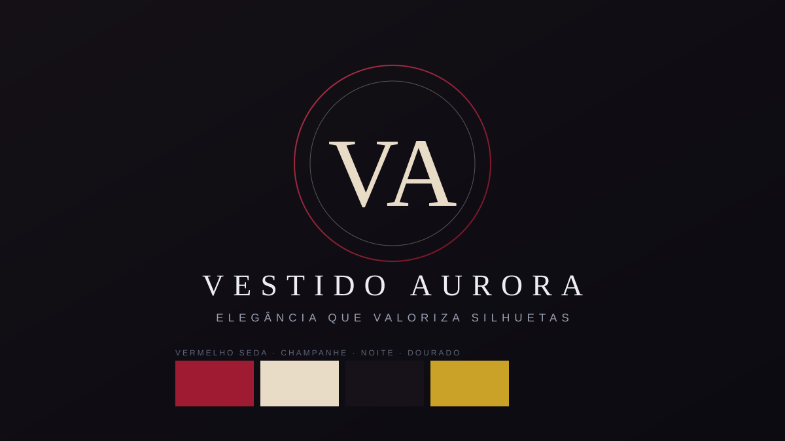

# Identidade visual

## O que define a marca

- Logotipo: monograma "VA" dentro de um círculo + wordmark "VESTIDO AURORA".
- Tom geral: elegante, atemporal e sofisticado, com leveza de seda.

## Paleta oficial

- Vermelho Seda `#9E1B32` — cor principal; remete ao Vestido Aurora.
- Champanhe `#E8DCC7` — apoio; texturas e luz de seda.
- Noite `#17121A` — fundos e momentos escuros.
- Dourado `#C9A227` — detalhes e sensação de luxo.

## Tipografia

- Títulos: serifada clássica (estilo Didot), com espaçamento generoso.
- Textos: sem serifa limpa para leitura de corpo de texto.

## Direção de imagem

- Fotografias elegantes, luz suave e difusa, silhuetas em movimento.
- Em campanhas de vídeo, priorizar a cor do tecido em close nos primeiros segundos.

## Regras de uso

- Nunca distorcer o monograma; respeitar área de segurança.
- Aplicar o logotipo sobre fundos escuros ou neutros (Noite/Champanhe).
- Ao citar a marca em textos oficiais, usar "Vestido Aurora" por extenso na primeira menção.
